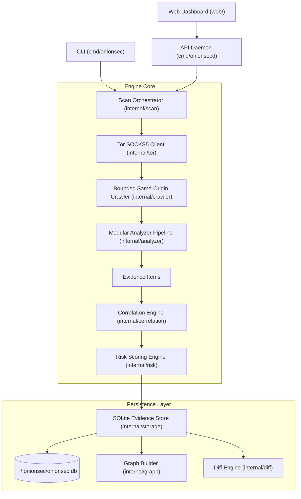

# OnionSec

[](https://github.com/FLATLINEDSTAR/OnionScan/actions/workflows/ci.yml)
[](https://opensource.org/licenses/MIT)
[](https://go.dev/)
[](#project-status)

**Security observability, evidence correlation, and configuration leak scanner for Tor onion services.**

Scan → Analyze → Correlate → Monitor

---

> ⚠️ **Authorized Use Only**  
> Only run OnionSec against `.onion` services you own or have explicit, documented authorization to test. OnionSec detects operational security leaks, misconfigurations, and metadata disclosures. It does not perform exploitation, traffic analysis, or network deanonymization.

---

## What is OnionSec?

OnionSec is an open-source defensive security observability tool built for operators and security auditors of Tor hidden services (`.onion`). It crawls targets through a local Tor SOCKS5 proxy, executes modular forensic analyzers, correlates atomic evidence items into confidence-weighted findings, and monitors exposure drift across scans.

### Why OnionSec?

Traditional dark web scanners treat raw pattern hits (such as a single regex matching an IP or email address) as definitive proof of vulnerability. In reality, raw string matches are **evidence indicators**, not conclusive proof.

OnionSec is designed around an **evidence-first model**:
1. **Atomic Evidence:** Detectors emit fine-grained evidence items (e.g., exposed headers, TLS certificates, IP literals, API routes, EXIF tags).
2. **Multi-Vector Correlation:** An evidence graph correlates multiple independent data points (e.g., matching infrastructure fingerprints or cross-service leaks) to produce high-confidence findings with calculated risk scores (0–100).
3. **Temporal Tracking:** Scan results and evidence items are persisted in SQLite, enabling automated drift detection (`onionsec monitor`), arbitrary scan diffing (`onionsec diff`), and scheduled audits.

---

## Architecture Overview



### Key Modules

- `cmd/onionsec/`: CLI utility providing `scan`, `report`, `monitor`, `diff`, and `graph` commands.
- `cmd/onionsecd/`: High-performance HTTP REST daemon providing API endpoints for automated scanning, job queues, and dashboard integration.
- `internal/tor/`: Dependency-free native SOCKS5 CONNECT client routing requests through Tor's `SOCKSPort` (`127.0.0.1:9050`) using hostname resolution on proxy to eliminate DNS leaks.
- `internal/crawler/`: Bounded, breadth-first crawler enforcing strict limits on maximum pages, body size, wall-clock time, and same-origin redirect constraints.
- `internal/analyzer/`: Pluggable analyzers (HTTP headers, OPSEC identifiers, TLS configuration, robots/sitemaps, JavaScript source maps, API endpoints, credentials, and image metadata).
- `internal/correlation/`: Synthesizes disparate evidence into high-confidence composite findings.
- `internal/storage/`: SQLite-backed persistent relational database utilizing WAL mode and serialized connection pooling.
- `web/`: Next.js dashboard featuring interactive Cytoscape.js network graph visualization and scan management.

---

## Quick Start

### Prerequisites

1. **Go 1.22+**: Required for building CLI and daemon binaries.
2. **C Compiler (CGO)**: SQLite persistence requires `CGO_ENABLED=1` (`gcc` or `clang`).
3. **Running Tor Daemon**: A local Tor instance listening on `127.0.0.1:9050`.
4. **Node.js 20+** *(optional)*: Only required if building and running the web dashboard.

### 1. Build Binaries

```bash
# Build the CLI
go build -o onionsec ./cmd/onionsec

# Build the HTTP daemon
go build -o onionsecd ./cmd/onionsecd
```

### 2. Basic Scanning

```bash
# Run a scan against an authorized target
./onionsec scan expyuzvj2wvx2n7wzrq4yquz7x7lcv7f4z2f4r6r6b7w6y6x7z2f4r6d.onion

# Export findings to JSON and Markdown simultaneously
./onionsec scan target.onion --json report.json --md report.md

# Re-render the latest saved scan report from SQLite
./onionsec report target.onion

# Monitor changes and detect exposure drift against previous scans
./onionsec monitor target.onion

# Compare two specific historical scans
./onionsec diff target.onion <scan-id-1> <scan-id-2>

# Generate evidence correlation graph (ASCII or DOT format)
./onionsec graph target.onion --format=dot --out graph.dot
```

### 3. Running the Daemon & Web Dashboard

```bash
# Start the HTTP API daemon (listens on 127.0.0.1:8080 by default)
./onionsecd -addr 127.0.0.1:8080 -db ~/.onionsec/onionsec.db

# Launch the Next.js web dashboard
cd web
npm install
npm run dev
# Dashboard available at http://localhost:3000
```

---

## Configuration

OnionSec supports flexible configuration via CLI flags, environment variables, and YAML configuration files:

```yaml
# ~/.onionsec/config.yaml
socks_addr: "127.0.0.1:9050"
limits:
  max_pages: 50
  max_body_byte: 5242880  # 5MB
  page_timeout: 20s
  total_budget: 5m
max_concurrent_scans: 4
max_queue_size: 32
```

Pass configuration to the CLI or daemon via `--config`:
```bash
./onionsec scan target.onion --config ~/.onionsec/config.yaml
./onionsecd --config ~/.onionsec/config.yaml
```

---

## Testing & Quality Assurance

All modifications are validated via unit tests, static analysis, and type checking:

```bash
# Run Go test suite with race detector
go test -v -race ./...

# Verify code formatting
test -z "$(gofmt -l .)"

# Run static analysis
go vet ./...

# Run frontend build and TypeScript check
cd web && npm ci && npm run build
```

---

## Project Status

| Phase | Milestone | Status |
| :--- | :--- | :--- |
| **Phase 1** | MVP Hardening & Core Scanners | Complete |
| **Phase 2** | Security Engine (TLS, Robots, JS, Secrets) | Complete |
| **Phase 3** | Relational Evidence Store & Correlation | Complete |
| **Phase 4** | Performance, Concurrency & Stream Limits | Complete |
| **Phase 5** | REST Daemon & Cytoscape Dashboard | Active Development |

---

## Security & Responsible Disclosure

We take the security of OnionSec and the privacy of monitored systems seriously. If you discover a vulnerability within OnionSec itself:

- **Do NOT open a public GitHub issue.**
- Report the vulnerability privately via [GitHub Security Advisories](https://github.com/FLATLINEDSTAR/OnionScan/security/advisories/new).
- Review our [Security Policy](SECURITY.md) for supported versions and our disclosure response SLA.

---

## Contributing

We welcome contributions from researchers and developers! Please read [`CONTRIBUTING.md`](CONTRIBUTING.md) and [`CODE_OF_CONDUCT.md`](CODE_OF_CONDUCT.md) before submitting pull requests.

Check out open issues tagged [`good first issue`](https://github.com/FLATLINEDSTAR/OnionScan/labels/good%20first%20issue) to get started.

---

## License

This project is licensed under the [MIT License](LICENSE).
